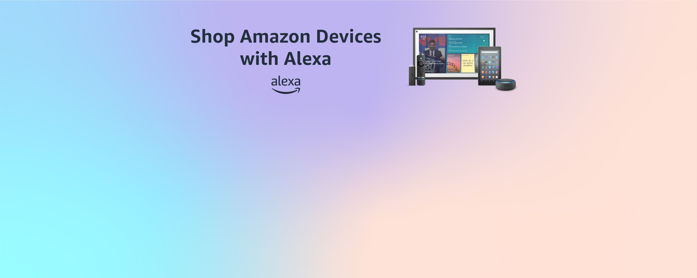

# Amazon Web Clone 📦

A professional, responsive, and visually stunning Amazon landing page clone built using modern web technologies. This project replicates the core layout and aesthetic of the world's most popular e-commerce platform.

## 🚀 Live Demo
You can view the project by cloning this repository and opening `web.html` in your browser.

## ✨ Features
- **Responsive Navigation Bar**: Includes logo, delivery location, search bar with category selection, account lists, returns, and orders.
- **Dynamic Hero Section**: Replicates the signature Amazon hero slider effect.
- **Product Categories Grid**: Showcases multiple product categories like Electronics, Clothes, Toys, Kitchen Products, and more.
- **Interactive Panel**: A secondary navigation panel with "Today's Deals", "Customer Service", and more.
- **Comprehensive Footer**: Includes "Back to Top" functionality and a multi-column links section just like the real site.
- **Modern UI/UX**: Uses clean CSS and Font Awesome icons for a premium feel.

## 🛠️ Technologies Used
- **HTML5**: For semantic structure.
- **CSS3**: For layout, styling, and responsiveness.
- **JavaScript**: For interactive elements.
- **Font Awesome**: For high-quality scalable icons.
- **Google Fonts**: For typography.

## 📸 Screenshots
### Desktop View


### Category Section


## 📁 Project Structure
```text
├── web.html        # Main entry point
├── style.css       # Core styling
├── script.js      # Interaction logic
├── *.png           # Asset images
└── README.md       # Project documentation
```

## 🔧 Installation & Usage
1. Clone the repository:
   ```bash
   git clone https://github.com/vekariya-gaurav123/amazon-web-clone.git
   ```
2. Navigate to the project folder:
   ```bash
   cd amazon-web-clone
   ```
3. Open `web.html` in your favorite browser.

## 🤝 Contributing
Contributions, issues, and feature requests are welcome! Feel free to check the [issues page](https://github.com/vekariya-gaurav123/amazon-web-clone/issues).

## ⭐️ Show your support
Give a ⭐️ if this project helped you!

---
*Created with ❤️ by [Gaurav Vekariya](https://github.com/vekariya-gaurav123)*
